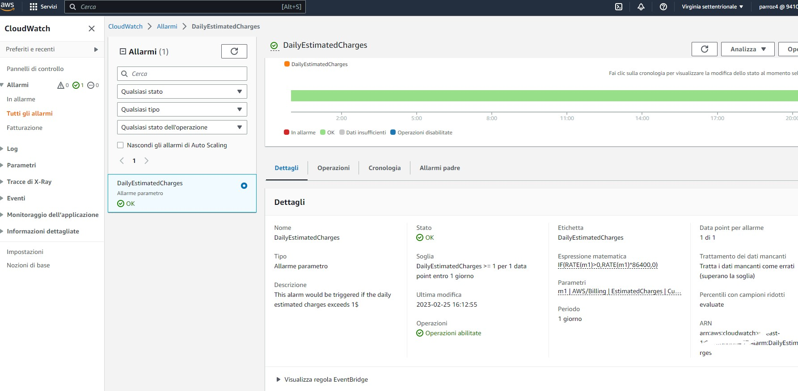

# Week 0 — Billing and Architecture

## Prerequisites

- AWS account (already created years ago, but the root one, so I've to configure the IAM user and an organization)
- Set up Gitpod, Lucidchart, Honeycomb, Rollbar accounts.
- Set up MFA on root and IAM AWS users.

## Required Homework/Tasks

1. Watched all playlist related to week 0, from the live session till the follow-up about credential security.
2. Set-up MFA on root and IAM users. Control IAM policies and no problem about them.

3. Use AWS CloudShell on eu-east-1 region.
  Image
   
4. Generate AWS Credentials related to the IAM user. And then put as environment variables in Gitpod.
  Image credentials AWS and Image environment variables
   
5. Install AWS CLI for Gitpod manually and then edited .gitpod.yml to automate installation.
  Code
6. Create a Budget, using the model JSON from Andrew Brown and then modified to my preference.
  
7. Create a billing alarm related to the previous budget using CloudWatch.
 
 
 
 
8. [Recreate Conceptual Diagram in Lucid Charts](https://lucid.app/lucidchart/5e4dc03f-20f3-43ff-aaff-686f6eb3dbd4/edit?viewport_loc=-608%2C-2%2C2812%2C1374%2C0_0&invitationId=inv_13b72710-5cf8-4918-8c93-e6b2a841bb1b)
9. [Recreate Logical Architectual Diagram in Lucid Charts](https://lucid.app/lucidchart/5e4dc03f-20f3-43ff-aaff-686f6eb3dbd4/edit?viewport_loc=-608%2C-2%2C2812%2C1374%2C0_0&invitationId=inv_13b72710-5cf8-4918-8c93-e6b2a841bb1b)

[AWS CLI Install Documentation Page](https://docs.aws.amazon.com/cli/latest/userguide/getting-started-install.html)

```
prova
```
